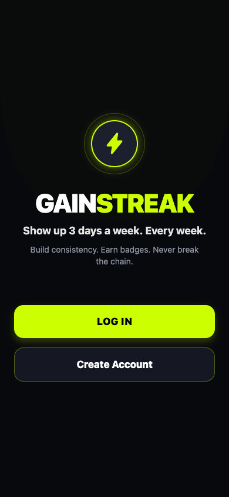
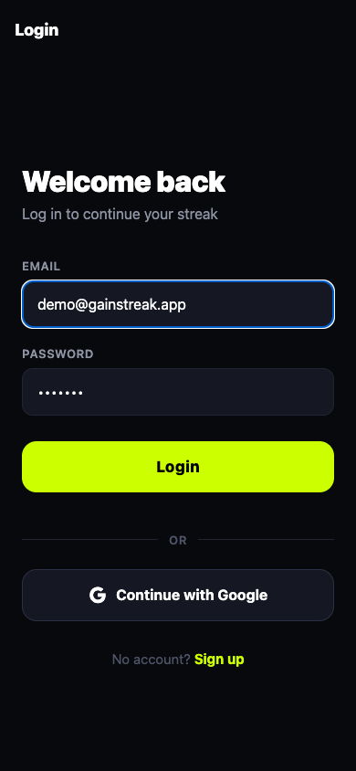
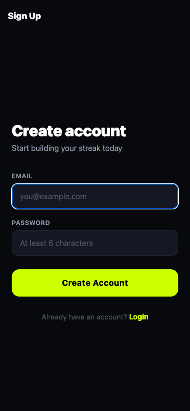
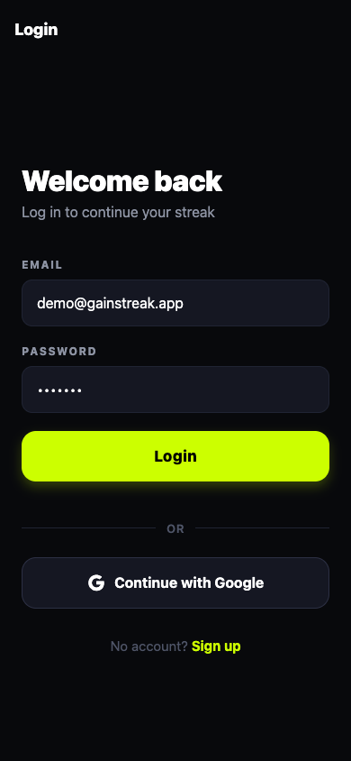
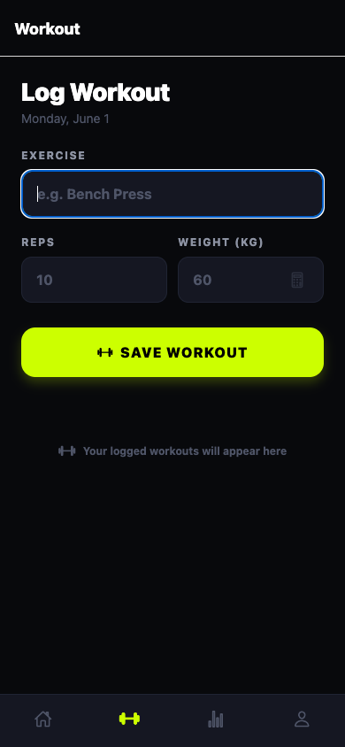
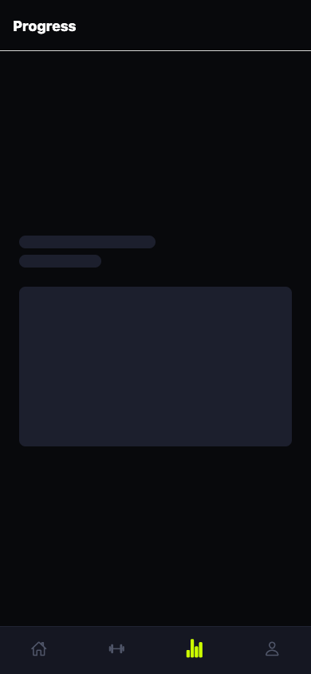
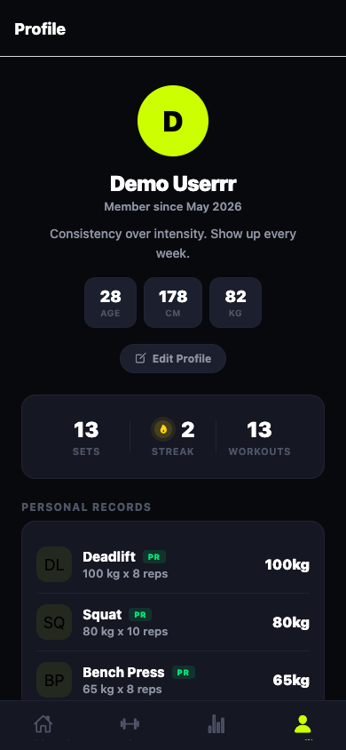

# Gainstreak

A fitness app that helps you stay consistent — 3 workouts a week, every week.

<table>
  <tr>
    <td></td>
    <td></td>
    <td></td>
    <td></td>
  </tr>
  <tr>
    <td align="center">Landing</td>
    <td align="center">Login</td>
    <td align="center">Sign Up</td>
    <td align="center">Dashboard</td>
  </tr>
  <tr>
    <td></td>
    <td></td>
    <td></td>
    <td></td>
  </tr>
  <tr>
    <td align="center">Workout</td>
    <td align="center">Progress</td>
    <td align="center">Profile</td>
    <td></td>
  </tr>
</table>

## Demo credentials

Log in with these credentials to explore the app:

| Field | Value |
|-------|-------|
| Email | `test@gainstreak.app` |
| Password | `test1234` |

The demo account has 6 weeks of workout history (18 sessions, 180 sets) across 6 exercises with progressive overload data.

## What it does

- Track your workouts (exercises, reps, weight)
- See your weekly streak (how many weeks you hit 3+ workouts)
- Earn badges as you stay consistent
- View your personal records for each exercise
- Calculate plate loads for barbell lifts

## How to run the app

### On your phone (easiest)

1. Download **Expo Go** from the App Store (iPhone) or Play Store (Android).
2. Open a terminal on your computer and run:

```
npm install
npm start
```

3. A QR code will show up. Scan it with your phone camera (iPhone) or the Expo Go app (Android).

### On a simulator

- **iPhone**: Run `npm run ios` (requires macOS and Xcode).
- **Android**: Run `npm run android` (requires Android Studio).

### In a web browser

```
npm run web
```

## Before you start

This app connects to a Supabase backend (a database in the cloud). You'll need to:

1. Copy `.env.example` to a new file called `.env`.
2. Fill in your Supabase project URL and anon key.
3. Run the SQL from `scripts/schema.sql` in your Supabase project to set up the tables.

If you don't have a Supabase account, go to https://supabase.com to create one (it's free).

## Built with

- React Native / Expo
- Supabase (database + authentication)
- JavaScript
